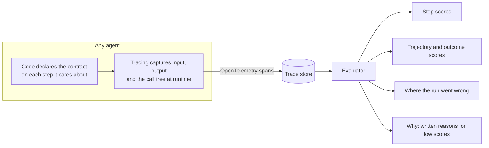
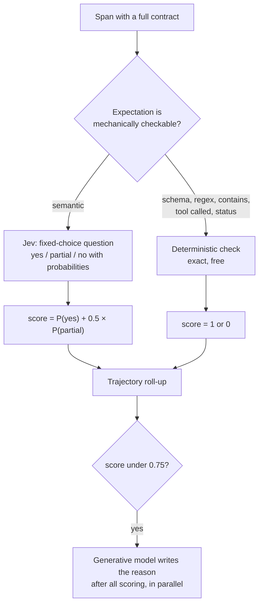
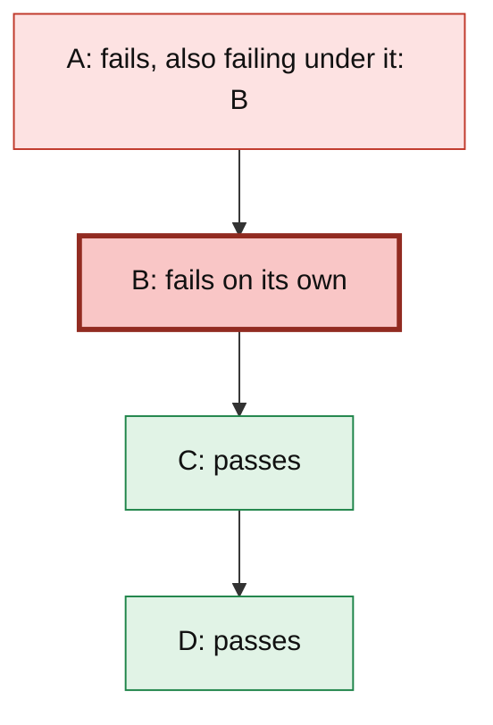
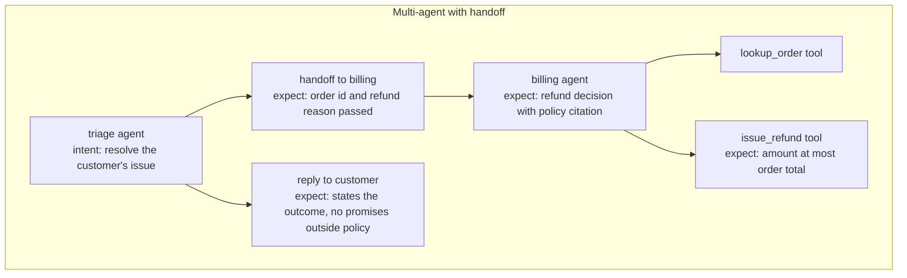
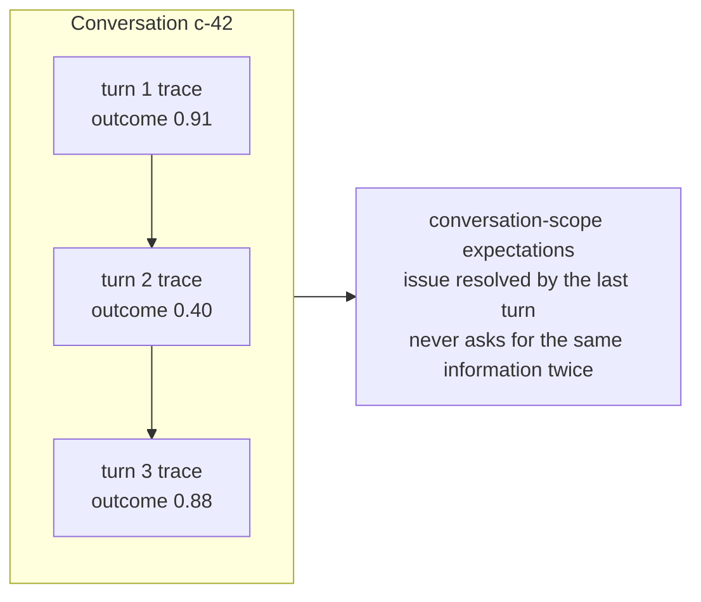

# Trace-native evals for agents

A general way to evaluate any agent, simple or complex. Code declares what each step should do, the tracing layer records what it actually did, and an evaluator scores every step and the run as a whole from the trace. Low-scoring steps get a written explanation, and the report names the step where a run started to go wrong.

The ideas below are framework-level. A proof of concept implements the core loop: `kimm.py`, a small deep-research agent, and `trace_evals.py`, the evaluator. The research agent appears only as a worked example near the end.

## The model in one picture



Every agent, whatever its shape, runs as a tree of steps. If each step records its contract and evidence on a span, one evaluator can handle all of them. Agent-specific logic stays in the agent's code, where the expectations are declared.

## Core concepts

### Trace and span

- A **trace** is one unit of agent work: a request, a task, or one conversational turn.
- A **span** is one step inside it: an LLM call, a tool call, a retrieval, a sub-agent, a handoff, or any function worth judging.
- Spans nest. Whatever runs inside a step becomes its child, so a trace is a call tree.

The framework adds no structure of its own; it reads the tree the code actually executed.

### The eval contract

Any span can carry a contract. A span is judged when it has intent, input, output, and at least one expectation:

| Field          | Meaning                                                    | Usually comes from                                                            |
| -------------- | ---------------------------------------------------------- | ----------------------------------------------------------------------------- |
| `intent`       | What this step is trying to achieve                        | `intent` or `overmind.intent`, else the nearest ancestor, else the root input |
| `expectations` | What a good result looks like. Each item is its own metric | `overmind.expectations`. A bare `expect` string counts as one metric          |
| `input`        | What the step received                                     | `input`, `overmind.input`, or the `overmind.arg.*` arguments                  |
| `output`       | What the step produced                                     | `output` or `overmind.output`                                                 |

A span missing any of these is recorded but not judged, and the report lists it as skipped and why. Instrumenting more of an agent therefore never breaks evaluation. It only widens coverage.

**Intent is inherited.** The user's goal belongs on the root span. A child that doesn't declare its own intent judges against the nearest ancestor's. This keeps sub-steps tied to what the user actually asked, rather than to a sub-goal that can pass while the run fails.

### Scoring

Each judged span gets a score from 0 to 1, from the cheapest method that can answer:



- **Jev** (`typesafe/jev-1.13`) is a System One model. It answers fixed-choice questions with a probability for every option and generates no text. It is fast and cheap enough to run on every expectation: one measured call on a ~400-token span cost $0.000016. A span's line is the mean of its metrics.
- **A generative model** (GPT-5.6 Luna in the POC) is called only for metrics under 0.75, and only after scoring finishes. The expensive model is spent on explanation, never on grading.

The deterministic branch isn't in the POC yet.

### Trajectory

A trace with several judged spans is a trajectory. The evaluator reports three things:

- **Outcome**: the root span's score. Did the run deliver what was asked? This is the headline number.
- **Trajectory**: the mean of every scored expectation. How well did the run behave along the way?
- **Failing nodes**: every span under 0.5, each labelled one of two ways:
  - **fails on its own**: nothing underneath fails, so the problem starts at this step;
  - **also failing under it**: a child fails too, so this step may be failing because of it.

For a chain A → B → C → D where C and D pass but A and B fail, B is reported as the step where the failure starts, and A as failing above it. That is the instruction a developer needs: fix B first.



## One model, every agent shape

Every agent shape below is a tree of spans with contracts, so the same evaluator handles each without changes.

| Agent shape                     | How it maps to spans                                                      | What the evaluator adds                                          |
| ------------------------------- | ------------------------------------------------------------------------- | ---------------------------------------------------------------- |
| Single LLM call                 | One span; outcome and trajectory are the same score                       | A per-call quality score on live traffic                         |
| Tool-calling loop (ReAct style) | A span per model turn, each tool call a child                             | Which turn or tool broke the loop                                |
| Planner and executor            | A plan span, then one subtree per executed step                           | Whether the plan or its execution failed                         |
| Workflow or DAG                 | One span per node; parallel branches are siblings                         | Branch-level scores and the failing node                         |
| RAG                             | A retrieval span (input query, output documents) under the answering span | Retrieval quality judged separately from answer quality          |
| Multi-agent with handoffs       | Each sub-agent is a subtree; the handoff is its own span                  | Per-agent scores, and whether a handoff passed the right context |
| Parallel fan-out and reduce     | Mapper spans are siblings; the reduce span's `expect` covers the merge    | Bad shards versus a bad merge                                    |
| Distributed or queued work      | Spans join the same trace across processes through W3C `traceparent`      | One trajectory across services                                   |
| Multi-turn conversation         | One trace per turn, grouped by a conversation id                          | Turn scores plus conversation-level expectations                 |
| Long-running or background job  | The trace grows over time; scoring starts when the root span ends         | Scores for jobs that run for minutes or hours                    |

The two hardest shapes, as they look to the evaluator:





Instrumentation can come from the agent's own code or from frameworks that already emit OpenTelemetry spans. Either way, the contract is extra attributes on spans the agent already produces. The evaluator doesn't care which framework built the tree.

## What the general framework needs beyond the POC

The POC proves the loop on one agent. Making it hold for every agent shape needs these:

1. **A reserved attribute namespace.** The evaluator reads the bare `intent`, `expect`, `input` and `output` keys and the `overmind.*` keys `@observe` writes. Bare names can still collide with application attributes; a single reserved prefix is the longer-term shape.
1. **Structured expectations.** Free text is the simplest form but not the only one. An expectation should carry:
   - a `kind`: `judge`, `schema`, `regex`, `contains`, `tool_called` or `max_calls`;
   - a stable `id`, so scores can be compared across runs and code versions;
   - a `scope`: `span`, `trace` or `conversation`;
   - `gate`: a failure caps the run's score instead of averaging away;
   - an optional weight.
     A span can carry more than one.
1. **Expectations that span several steps.** Some rules involve more than one node: "the brief cites only pages that were actually read", "at most three searches", "the reply matches the refund that was issued". These attach to the root span with `scope=trace`, and the evaluator checks them against the whole tree.
1. **Grounding as a built-in check.** For any agent that reads from the world (tools, retrieval, other agents), split the final output into its claims and check each claim against the outputs of earlier spans in the trace. Each claim is a small yes-or-no question, which suits Jev, and this one check catches most research and RAG failures.
1. **Payloads outside span attributes.** Attribute size limits force truncation; the POC cuts outputs to a few thousand characters, and a judge that sees half a tool result marks it unsupported. Store full inputs and outputs as artifacts referenced from the span, with redaction for PII before export.
1. **Automatic capture.** Developers should declare `intent` and `expect` only. A decorator or context manager captures arguments and return values, so `input` and `output` are never hand-written.
1. **Context propagation everywhere.** Threads, async tasks, job queues and service calls must all carry the trace context. Without it a sub-agent starts a new, rootless trace and its scores never join the trajectory.
1. **Knowing when a trace is complete.** Score when the root span ends. If the root never ends, score after a stale timeout.
1. **Aggregation.** Group scores by step name, by agent, by code version and by expectation id. That's what turns per-trace reports into trends, regressions and "this tool has been failing since Tuesday".
1. **Judge qualification.** Jev's probabilities are confident, not guaranteed correct. Keep a small hand-labelled set for each kind of expectation. Track how often the judges agree with it, and version the judge configuration alongside the scores.
1. **Cost control.** Sample high-volume production traffic. Cache verdicts by expectation id plus hashes of the input and output, and score only spans that carry a contract.

### A sketch of the developer surface

This is an illustration, not an existing API:

```python
@step(expect="Wikipedia titles matching the query")
def wiki_search(query: str) -> list[str]: ...


@step(
    intent=lambda ticket: ticket.question,
    expect=[
        Expect.judge("states the refund decision and cites the policy"),
        Expect.schema(RefundDecision),
        Expect.max_calls("issue_refund", 1, scope="trace", gate=True),
    ],
)
def billing_agent(ticket: Ticket) -> RefundDecision: ...
```

Arguments and return values become `input` and `output`. Intent is inherited when omitted. Everything else is ordinary code.

## Why declare evals in code

The usual alternative keeps eval definitions in a separate file, such as a TOML or YAML config that names functions, datasets and rubrics. That splits one behaviour across two places, and the two drift apart.

- **No drift.** The expectation lives next to the code that produces the behaviour. Rename, split or delete a function and its expectation moves or disappears with it, in the same diff. A separate config refers to functions by name or path, and those references go stale silently: an eval for a renamed function either errors or passes because it no longer matches anything. With in-code evals, updating the code updates the evals.
- **One place for context.** An eval needs the intent, the input and the output. In code, all three are captured at runtime from the real call. With a separate file, someone has to reconstruct that context, map dataset columns to function arguments, and keep that mapping in sync with the code.
- **Reviewed with the change.** A pull request that changes what a step should do changes its `expect` in the same diff. Reviewers see the behaviour change and the new expectation together.
- **Works for every agent shape.** A config file has to describe the agent's structure: which steps exist, how they nest, which agent hands off to which. In code, the structure is whatever actually ran. A new tool, a new sub-agent or a reordered workflow is evaluated correctly without anyone editing a second file.
- **Every run is an eval.** Expectations ride on production traces, so evaluation covers real traffic, not only a fixed dataset. Each trace also carries the service version, so every score is tied to the code that produced it.
- **Granular enough to pinpoint.** Because each step carries its own expectation, the report can say which step failed, not just that the run failed.
- **Low ceremony.** Adding an eval is one argument on a step the code already has.

### What it does not replace

- **Offline regression sets.** In-code expectations score whatever traffic happens to arrive. To compare two versions of an agent on the same inputs, you still need a fixed set of inputs, run against both versions and scored with the same contracts.
- **Specific expectations.** "Research output on the topic" is too vague for any judge, and the score is noisy as a result. The framework makes expectations cheap to write; it can't make them precise.
- **Human review.** A sampled slice of traces labelled by people is the only check that the judges themselves are right.

## Worked example: a deep-research agent

The POC agent plans two Wikipedia queries, researches each with `wiki_search` and `wiki_read` tool calls in an LLM loop, and writes a brief. Every step carries the contract:

```python
with traced(
    "wiki_search",
    intent=query,
    expect="Wikipedia titles matching the query",
    input=query,
) as span:
    ...
    span.set_attribute("output", result)
```

The traces go to PostHog Tracing over OTLP (`/i/v1/traces`). The evaluator reads them back with a HogQL query on `posthog.trace_spans` and rebuilds each tree from `parent_span_id`. It scores every complete span with Jev in parallel, prints each trace, then asks GPT-5.6 Luna for reasons on spans under 0.75. A real trace for "What are the main differences between CRISPR-Cas9 and base editing?":

```text
trace e380029fbc273efbaa1a570b18eaa68b
  trajectory 0.59   outcome 0.46   (15 scored, 0 skipped)
  research                     0.46 partial FAIL
    llm                        0.84 yes     ok
    dig                        0.62 partial ok
      llm                      0.51 partial ok
      wiki_search              0.52 partial ok
      llm                      0.61 partial ok
      wiki_read                0.45 partial FAIL
      llm                      0.95 yes     ok
    dig                        0.79 yes     ok
      llm                      0.47 partial FAIL
      wiki_search              0.41 partial FAIL
      llm                      0.66 partial ok
      wiki_read                0.03 no      FAIL
      llm                      0.73 yes     ok
    llm                        0.80 yes     ok
  failing nodes:
    research (0.46) - also failing under it: llm, wiki_read, wiki_search
    wiki_read (0.45) - fails on its own; everything under it passes
    llm (0.47) - fails on its own; everything under it passes
    wiki_search (0.41) - fails on its own; everything under it passes
    wiki_read (0.03) - fails on its own; everything under it passes

============================== Generating why they are failing ==============================
11 nodes scored under 0.75; asking openai/gpt-5.6-luna...
```

Selected rows from the reasons table:

|   # | Node        | Score | Expect                                                     | Why it falls short                                                                                                                                                                                                                                                     |
| --: | ----------- | ----: | ---------------------------------------------------------- | ---------------------------------------------------------------------------------------------------------------------------------------------------------------------------------------------------------------------------------------------------------------------- |
|   1 | research    |  0.46 | research output on the topic                               | The response is too vague and incomplete: it does not explain that base editors use a Cas protein plus a deaminase to make specific base conversions without double-strand breaks, nor does it clearly compare editing outcomes, precision, and limitations with Cas9. |
|   8 | wiki_search |  0.41 | Wikipedia titles matching the query                        | The output includes "Best Editing," which does not match the query, and fails to provide accurate Wikipedia title formatting or a complete set of matching titles.                                                                                                     |
|  10 | wiki_read   |  0.03 | the lead summary of that Wikipedia page                    | The output summarizes the broader "Genome editing" page rather than providing the lead summary for the "Base editing" page. It omits base editing's defining mechanism and key characteristics.                                                                        |
|  11 | llm         |  0.73 | a wiki_search or wiki_read call, or 3 to 5 factual bullets | The bullets misattribute information from the "Genome editing" page to "Base editing," treating the redirect content as if it directly described base editing. This makes the factual claims about base editing inaccurate.                                            |

Read top to bottom, the trace tells the story of the failure. The search for "base editing" returned a weak match, and the read landed on the generic "Genome editing" page. The notes then attributed that page's content to base editing, so the final brief never explained the mechanism that tells the two techniques apart.

Across the four runs with full contracts, the mean trajectory score was 0.56, and `wiki_search` failed on its own in every one. The example also shows two limits from the requirements list above:

- **Ambiguous wording reads as failure.** The model's tool-calling turns expect "a tool call, *or* bullets". Both judges read that as "bullets required", so correct tool calls score about 0.5.
- **The root expectation is too vague** to produce a reliable outcome score.

## Running the POC

```bash
uv run python kimm.py "What are the main differences between CRISPR-Cas9 and base editing?"
uv run python trace_evals.py                                    # every trace from the last 24 hours
uv run python trace_evals.py e380029fbc273efbaa1a570b18eaa68b   # one trace
```

Requirements, read from `.env`:

- `OPENROUTER_API_KEY`, for Jev and GPT-5.6 Luna.
- `POSTHOG_PERSONAL_API_KEY`, a `phx_` key with `query:read`. The `phc_` project token can only write.
- Optional overrides: `POSTHOG_HOST` (default `https://eu.posthog.com`), `POSTHOG_PROJECT_ID` (default `@current`). `TRACE_SERVICE` limits the query to one service name (`kimm`, `overmind`); unset reads every service.

Thresholds live at the top of `trace_evals.py`. A step fails under `FAIL_BELOW = 0.5` and gets a written reason under `REASON_BELOW = 0.75`.
