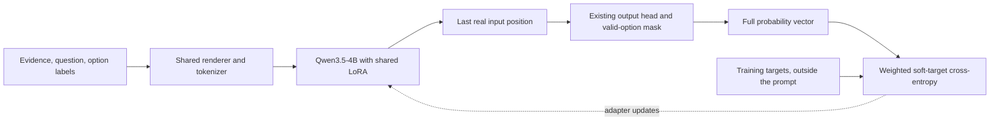

# Jev-style training: findings, changes and remaining work

> Historical experiment record. Current implementation and qualification are tracked in [the platform verification report](platform-improvements/verification-plan.md). Earlier launch holds, runtime limitations and estimates below describe their recorded point in time. The authorized full run is `a356c75d-788a-4a35-bd30-1d24ae7afab8`; its existing completion protocol remains authoritative. New platform changes are isolated and have not been deployed over it.

Snapshot: October 2, 2026. Repository branch: `codex/general-decision-training`. This report describes the current implementation; the earlier architecture-and-experiment-plan document is a historical proposal and contains superseded counts and implementation status.

The native training mechanism works in small GPU qualifications. Full-corpus training has not started, the independent final benchmark predictions have not run, and model quality across tasks remains unproven. The user has explicitly held the full launch pending cost/time review. The already running representative pilot and CPU preparation may finish; their completion does not release that hold. At the status check for this review, the pilot had completed 31 of 65 optimizer steps and full preparation was still running.

**What “general” means for this model.** One pretrained Qwen3.5-4B backbone and one shared LoRA adapter handle many decision tasks. Every request supplies evidence, a question, a decision kind and its own option labels. The current interface supports 2–255 distinct options, including binary decisions and ordered score distributions. There is no separately trained classifier for each benchmark. This supports an experiment in generalization across tasks and label sets; it does not yet demonstrate that generalization, guarantee preservation of chat ability, or reproduce proprietary Jev internals.

**The model architecture.** We retained the existing pretrained backbone and Unsloth model-family loader. We added a shared renderer, tokenizer codebook, decision readout and dedicated optimization loop. Stock assistant-token SFT is a different objective, so the native branch does not use its loss. No fork of the Unsloth or TRL libraries was required for this implementation.

Each runtime option maps to a verified single-token code. The model processes the complete evidence/question/options prompt. The readout selects the last non-padding hidden state, applies the model's effective output head, selects the supplied options' logits, and normalizes over those options. This avoids constructing sequence-length × vocabulary logits while preserving gradients and any effective output-head adapters. Probabilities and stable log-probabilities are returned directly. They are conditional scores over the supplied options; normalized output alone does not establish empirical calibration.

This is one forward computation per decision, batched across decisions. A shared learned option encoder, joint multi-question branching and prefix-state reuse are not implemented. The original attention/recurrent backbone architecture has not been replaced.

**The training objective.** The implemented loss is weighted soft-target cross-entropy:

\[
L=\\frac{\\sum_d w_d\\left[-\\sum_i q\_{di}\\log p\_{di}\\right]}{\\sum_d w_d}.
\]

Hard labels use one-hot targets. Soft labels retain their complete distribution; a binary probability becomes the declared false/true pair. Padded options receive no probability or loss. Log-softmax and loss operate in FP32 with BF16 model execution. Targets, weights and provenance never enter the inference prompt. Accumulation normalizes over all weighted decisions in an optimizer batch, avoiding the error of averaging unequal microbatch means. Nonfinite logits and gradients fail explicitly.

Brier and ranked probability score are implemented evaluation metrics, not additional terms in the current training objective. There is no PPO, GRPO, reward model or RL phase. A mean rating is not automatically an observed outcome distribution: the scorer uses expected-score errors for mean-only references rather than fabricating categorical NLL/Brier.

**Data selected and protected.** The source is `tasksource/tasksource-jev-typed-decisions`, pinned to revision `8173a06c7bb640b6158c6a93519cb535196bef15`. The unchanged 2.5-million-row training source successfully landed through Overmind after the memory repairs.

| Selected material                  |     Count |
| ---------------------------------- | --------: |
| Training decisions                 | 1,164,217 |
| Hard targets within training       | 1,033,818 |
| Soft targets within training       |   130,399 |
| Separate validation decisions      |     7,210 |
| Representative throughput pilot    |     8,320 |
| Runnable final benchmark decisions |   131,555 |
| Runnable calibration decisions     |    32,784 |

The declared selection uses the publisher's commercial-use flag, validates targets/options and excludes benchmark source families and matched content groups. It records 49 excluded source aliases and 803 matched groups. This is not independent legal clearance of every upstream dataset, nor proof against paraphrase overlap or contamination in the pretrained backbone.

Input identity now includes the actual evidence/question/options, excludes supervision, and recognizes explicit `group_id`. The same input with a different target cannot evade overlap/group handling. Selected row order, duplicates and target probabilities survive training preparation. Workshop's automatic deduplication changed seven pilot rows, so the run pins the original 8,320-row source cell. Declared validation multiplicities were also preserved rather than accepting an automatically deduplicated population.

**Large-data architecture changes and why they were necessary.** Initial imports and later SQL queries exhausted the local worker's memory. The corpus did not fit safely after whole-frame Python/Arrow expansion. We changed file imports to iterators and bounded batches, inferred schemas across the complete stream, staged intermediate records on disk, and published Parquet outputs atomically. Targeted row reads load only relevant row groups.

Explicit `transform_batch(df)` cells now support row-local streaming transformations. Ordinary Python cells retain their whole-frame semantics; arbitrary global transforms have not silently become batch-local operations. Proposal comparison, membership checks, provenance and deterministic audits operate over files or disk indexes, including late rows. Parent processes no longer reload a complete transformation output merely to preview it.

Dataset SQL now scans registered Parquet files directly under a 512 MB DuckDB limit. It retains a strict read-only SELECT interface, locked configuration and file allow-list, with external access disabled. The old “load every table first, then disable access” design was memory-heavy. An interrupted import also fails visibly on broker redelivery instead of repeatedly restarting the same memory failure. Cursor agent cleanup now cancels unfinished provider work before closing the SDK handle when interruption is catchable.

These repairs qualify the paths exercised by this experiment. Some generic source-splitting and ordinary whole-frame operations still retain data in memory; the entire Data Workshop is not claimed to be constant-memory.

**Exact preparation and tokenization.** Training now stages hashed JSONL files through Modal Volumes, tokenizes incrementally on CPU, and matches selected rows against frozen token artifacts through a bounded SQLite index. Source targets participate in preparation identity, preventing stale token artifacts from hiding changed supervision. Processor and training-runtime identities are tracked separately. Incompatible or over-context rows remain explicit failures; evidence is never silently truncated to make a run pass.

Preparation deadlines were increased from 20 minutes to 24 hours, and submission acknowledgement tolerance from two to 30 minutes, to accommodate large file staging. This does not extend the GPU's per-attempt timeout.

We found that a raw answer boundary could merge an option code with the preceding text. The renderer uses the model's chat template with thinking disabled and verifies the next-token boundary. Repeated exhaustive checks were expensive. The optimized encoder still tokenizes each complete prompt but reuses verified suffix checks only for qualifying deterministic BPE/special-token boundaries; other cases use exhaustive checks. On 8,330 decisions and 84,072 prompt/option checks, outputs matched exactly and this tokenizer qualification ran 19.14× faster. This is not a claim of 19× faster GPU training.

**GPU execution and recovery.** The native path currently supports Modal LoRA on one GPU. Full-parameter and distributed native training are explicitly unqualified. Packing is disabled. Length-aware ordering uses bounded shuffle/sort blocks, and microbatches are limited by both row count and padded-token budget while preserving the effective optimizer batch.

The proposed full recipe is one epoch, LoRA rank 16 / alpha 32 / dropout 0, effective batch 128, learning rate 1e-4, 5% warmup, weight decay 0.01, seed 73491 and context 131,072 on H200. This is a proposed experiment recipe, not a demonstrated optimum. The 131,072-token context ceiling is distinct from actual example lengths; the pilot's maximum is 34,449 tokens.

Atomic recovery checkpoints save trainable parameters, AdamW moments, scheduler, Python/torch/CUDA RNG state, optimizer step and token count. Resuming checks immutable base, data, runtime and configuration identities. Saves are attempted after optimizer steps at roughly five-minute intervals, so a long step can extend the interval. Native provider retries resume saved work rather than deliberately beginning a new training schedule. The GPU interruption fixture restored steps 14, 21 and 27 and completed its 80-step schedule.

Fresh-process adapter reload is a separate requirement before artifact publication. A content-hashed manifest seals model files, tokenizer, codebook, renderer, training identities and verification evidence. File changes or failed parity checks prevent publication. An already published valid artifact makes completion idempotent.

**Bugs exposed by the experiments.** Requested seeds were previously dropped by the planner: the earliest runs actually used 42 despite requesting 73491. The handoff is fixed and later logs verified 73491. Modal estimates previously reused Baseten's pricing assumptions; they now use Modal's per-second GPU rate. Ledger GPU selection now includes context length so an H200 job is not classified using the shorter-context H100 selection. Resume telemetry previously divided cumulative progress by only the new attempt's time, inflating throughput and shortening ETA; it now subtracts restored starting counters.

The generic platform estimate still uses assumed H100 FLOPs/throughput. Correcting its price does not make its approximately $25 / 6.4-hour full-corpus result a validated forecast for this native H200 path.

**Independent evaluation design.** The research datasets are separate from product capabilities and product evaluator sets. The final suite has the following runnable decisions:

| Benchmark      | Decisions | Coverage                                     |
| -------------- | --------: | -------------------------------------------- |
| Banking77      |     3,080 | Fine-grained intent classification           |
| SST-5          |     2,210 | Five-level sentiment                         |
| BoolQ          |     3,270 | Binary reading comprehension                 |
| CLINC150       |     5,500 | Intent classification and out-of-scope cases |
| ARC-Challenge  |     1,172 | Science questions                            |
| HellaSwag      |    10,042 | Commonsense completion                       |
| WinoGrande     |     1,267 | Reference resolution                         |
| PIQA           |     1,838 | Physical commonsense                         |
| XNLI           |    25,050 | Multilingual inference                       |
| HANS           |    30,000 | Inference heuristic stress                   |
| MMLU-Pro       |    12,031 | Broad subject questions                      |
| Civil Comments |    35,000 | Attribute probabilities                      |
| Sys1Cal        |     1,095 | Probability/calibration tasks                |

These are decision counts, not necessarily independent source examples: translated cases and multiple questions per state retain shared group identities. One final item and 14 calibration items have incompatible duplicate options; they remain recorded. Calibration also excludes 168 overlapping source rows. MMLU-Pro uses the fixed direct-decision protocol and is not a chain-of-thought leaderboard replication.

An input-only token audit verified 31,645,575 final tokens and 9,953,022 calibration tokens, with zero additional tokenizer failures or context overflows. Baseline plus candidate therefore require 83,197,194 input tokens over 328,678 decisions. This audit generated no predictions.

The experimental Modal inference app receives only inputs. The scoring CLI joins sealed references afterward, verifies hashes and model identity, and keeps missing/invalid prediction coverage visible. Implemented measures include hard-label accuracy, fixed-label macro-F1 where applicable, NLL/soft cross-entropy, full-vector Brier, ordinal RPS, expected-score errors, reliability/ECE, selective performance and benchmark slices. It supports equal-benchmark macro summaries, grouped bootstrap intervals and paired baseline/candidate comparisons over shared valid cases. CLINC additionally reports OOS AUROC, average precision and descriptive FPR at 95% TPR. Those descriptive thresholds are not approved production routing thresholds.

Fitted calibration, final-suite scoring and dedicated option-permutation, paraphrase, evidence-injection and related robustness panels remain unfinished. The public benchmark list is broader than the initial three requested sets, but breadth alone is not evidence of quality.

**What has actually been verified.** Four platform GPU qualification jobs succeeded. One complete small epoch improved validation CE from 1.1168 to 1.0144 and accuracy from 54.9% to 60.8%. An earlier short canary worsened CE, and repeated ten-epoch recovery fixtures overfit. These are engineering results on small fixtures, not final generalization evidence.

Saved/reloaded adapters reproduced 64 probes with maximum absolute probability difference 0.0 in the reported qualification. Independent native GPU inference matched 64 saved training probes within 1.49e-8. The interruption fixture proves that optimizer continuation operates; it does not establish bitwise equivalence between independently trained GPU runs. Those arms already differed before interruption and later differed materially.

Selected saved test results are 175 passing native regression checks, 165 passing Workshop/lifecycle checks, 67 passing batching/loss/resume checks, 32 passing resume/telemetry checks with two dependency-related skips, and 12 passing benchmark scorer checks. These runs overlap and happened at different implementation points; do not add them into a unique-test total or describe them as one final full-repository test run. The command, input, environment and output receipts are in `decision-training-verification.md`. Relevant pre-commit checks passed. No new training or benchmark job was started to prepare this handover.

**Platform changes versus remaining product integration.** Dataset contracts, training preparation, serializers, job orchestration and MCP now recognize native decision training. The objective is frozen from the selected cell; mismatched objectives, packing, unsupported providers/methods and chat evaluation flags are rejected. MCP exposes the native inference contract and recorded training cost. Successful native jobs finish as decision artifacts instead of being sent automatically into chat deployment. Existing API-client regeneration produced no generated frontend changes.

The standalone native evaluation worker is deployed, but it is not yet an ordinary platform `EvalRun` mode. The API still artificially requires a dedicated chat eval dataset/set attachment even when every chat evaluation flag is disabled. This run uses a research-only placeholder; no product evaluator is repurposed. Removing that mismatch is a required product change.

The remaining integration work is a project-scoped decision-model artifact registry and archive/download lifecycle; native baseline/candidate evaluation within the existing evaluation service; typed probability serving; Console setup/results/playground; corresponding REST/MCP/generated-client/CLI contracts; and activation after serving reliability, latency and concurrency qualification. Model training success, benchmark quality, deployment readiness and live activation must remain distinct states. Product aliases and the external Jev provider have not been switched.

**Where the implementation lives.** The principal code areas are:

| Area                                                     | Files                                                                                                                                                                            |
| -------------------------------------------------------- | -------------------------------------------------------------------------------------------------------------------------------------------------------------------------------- |
| Typed request, validation, codebook, renderer, tokenizer | `modal_shared/decisions.py`                                                                                                                                                      |
| Native readout/loss and optimization                     | `overbae/services/sft_assets/decision_readout.py`, `decision_engine.py`, `engine_unsloth.py`                                                                                     |
| Batching, checkpoint recovery, artifact integrity        | `modal_shared/decision_batching.py`, `decision_checkpoint.py`, `decision_artifact.py`                                                                                            |
| Exact preparation and file handoff                       | `modal_shared/preparation.py`, `training_data.py`; `overbae/services/training_preparation.py`; `sft_assets/preprocess.py`                                                        |
| Dataset streaming, review and lineage                    | `overbae/services/datasets/files.py`, `land.py`, `store.py`, `review.py`, `partition.py`, `contract.py`; notebook runner/agent and `cell_runtime.py`                             |
| Training policies, validation, billing, lifecycle        | `overbae/services/finetuning_policy.py`, `finetuning_validator.py`, `finetuning_pricing.py`, `finetuning_runner.py`; `overbae/tasks/finetuning.py`; `overbae/api/serializers.py` |
| MCP contracts/resources                                  | `overbae/services/mcp/tools_finetuning.py`, `resources.py`                                                                                                                       |
| GPU training and evaluation workers                      | `overbae/modal/modal_sft_worker.py`, `modal_decision_evaluation.py`                                                                                                              |
| Native inference and metrics                             | `modal_shared/decision_inference.py`, `decision_metrics.py`; `sft_assets/prepare_decisions.py`                                                                                   |
| Benchmark conversion, scoring, recovery qualification    | `scripts/decision_benchmarks.py`, `score_decision_benchmarks.py`, `qualify_decision_resume.py`                                                                                   |
| Tests and operating instructions                         | Feature-specific files under `tests/`; `AGENTS.md`; backend-architecture and data-workshop skills; experiment documents                                                          |

**Cost and current handoff.** The provisional incremental allowance remains $150–$400 and 30–80 hours for one corpus epoch plus matched research evaluation and a 25% contingency. It is based on sample-estimated 463.9 million training tokens, a measured warm qualification proxy, explicit slower-case assumptions and the exact benchmark input audit. The representative pilot deliberately oversamples 128 large inputs; those contribute about 38% of pilot tokens, so scaling the pilot's raw mean row cost would be misleading. Exact full preparation and pilot completion must refine the estimate. It is not a spending cap and excludes sunk experiments, engineering time, production hosting, tax and plan fees.

Four platform qualifications record $1.8022 in GPU ledger charges. That is not total project expenditure: direct Modal recovery/inference experiments, the current pilot, CPU preparation and other costs are separate. No complete provider invoice has been reconciled.

All repository changes remain uncommitted on the feature branch; nothing was pushed or merged. Updated experimental Modal workers were deployed in `overmind-dev`, and local Overmind services use the workspace changes. No public probability endpoint, production model activation or finished customer workflow is claimed. Full training remains held until the user instructs us to proceed after reviewing estimates.
