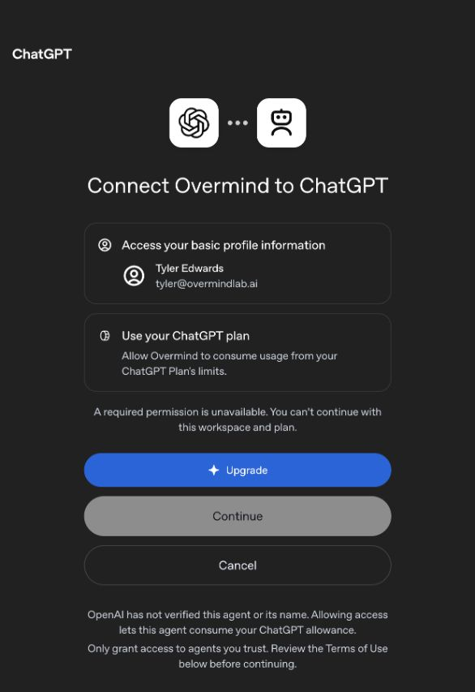
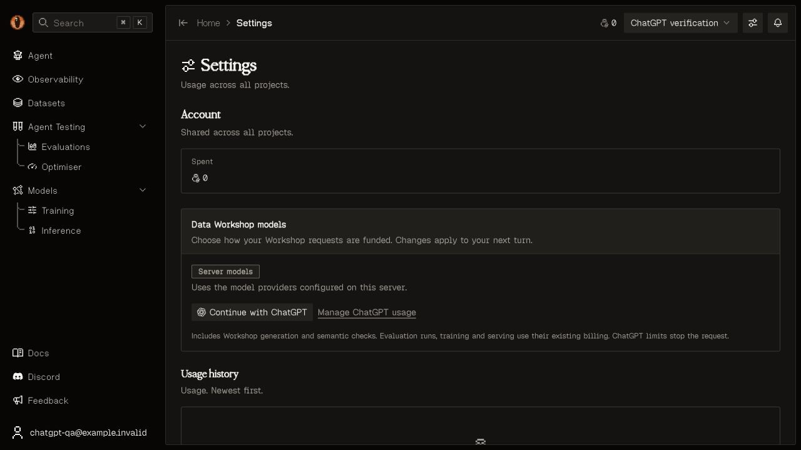
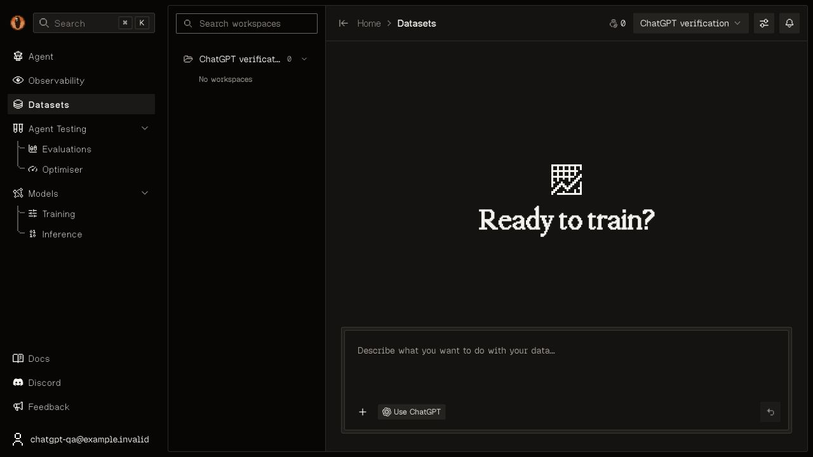
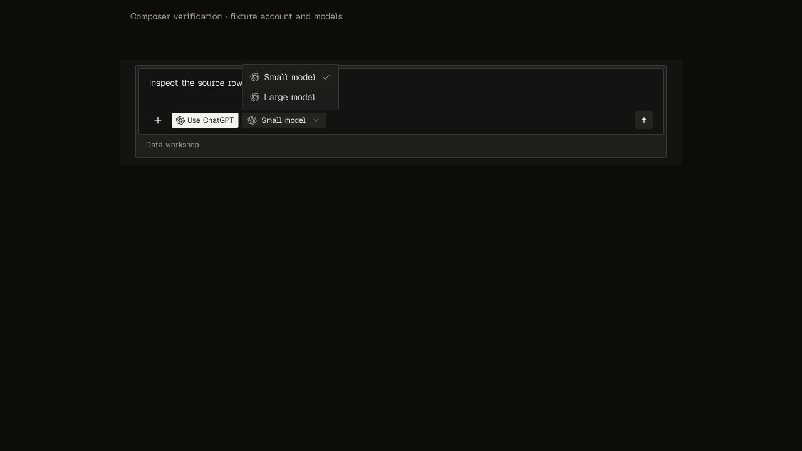
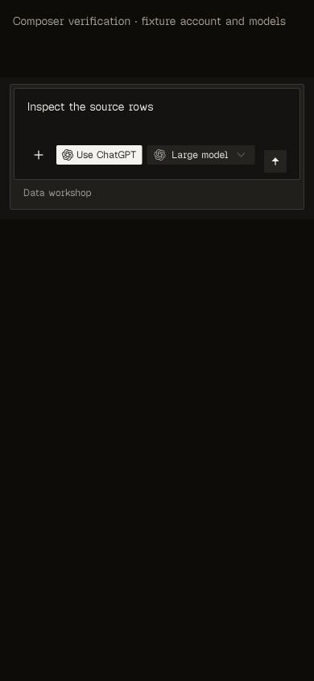
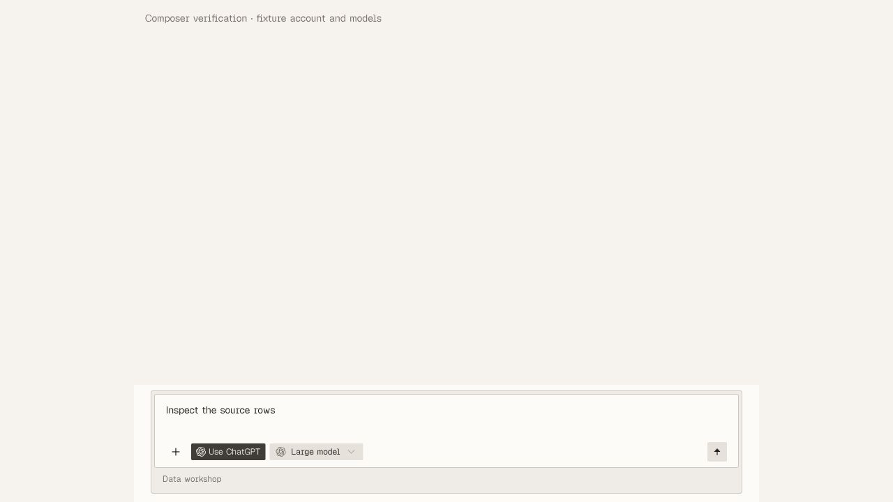
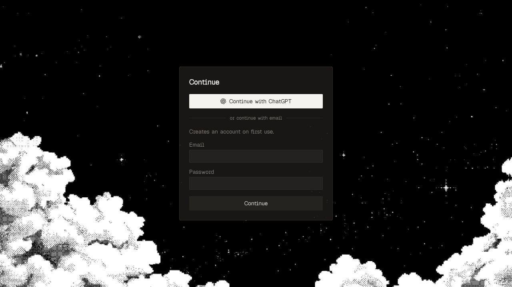
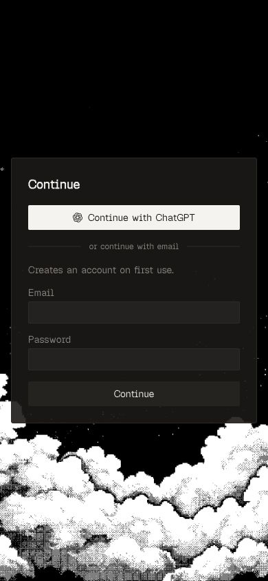
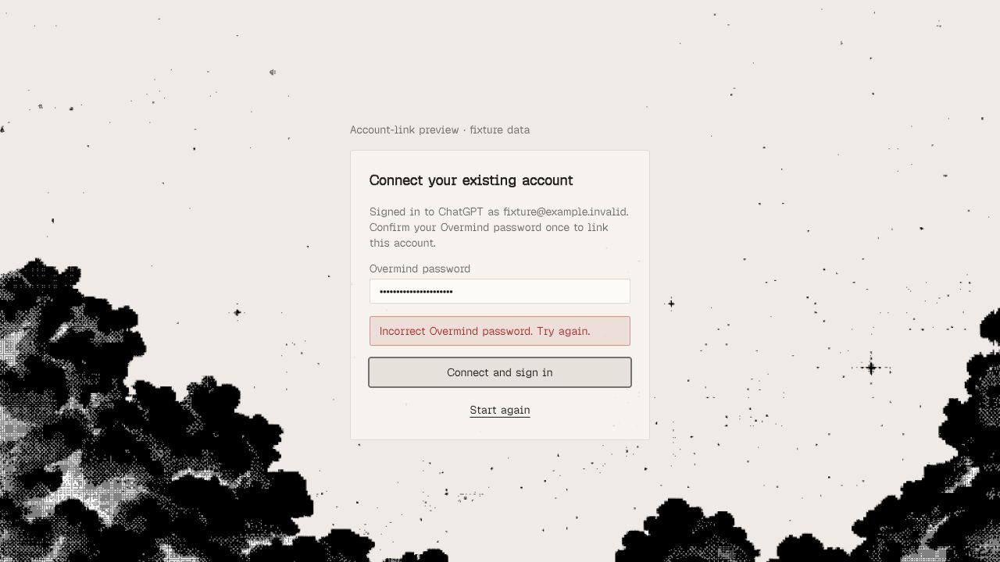

# ChatGPT plan usage verification

The OAuth provider is replaced at the HTTP boundary in the repeatable integration
run; no real account, allocation, or platform API key is used. A real browser
consent and inference run remains a separate acceptance check.

Failure cases defined before implementation:

- A cloud deployment exposes the local connection or uses imported credentials.
- A guest, another user, forged state, missing browser cookie, replayed callback,
  expired attempt, changed registration, bad signature/audience/nonce/subject, or
  declined plan permission gains access to a connection.
- Tokens appear in REST/MCP output, logs, browser storage, or plaintext database fields.
- Refresh rotation races, loses the replacement token, or clears valid credentials
  after a transient failure; disconnect silently switches to platform spending.
- The model is unavailable to the selected account; a tool executes before a
  terminal completed response; an interrupted or failed stream is treated as success.
- A ChatGPT-funded agent turn calls a platform model or Jev for semantic checks,
  deducts credits, requires platform credits, or bills a resumed audit twice.
- Existing platform-funded work loses its current engine or billing behavior.

Callback recovery failures defined before the repair:

- An initial `invalid_grant` discards the issued registration or reports an expired
  ChatGPT account; recovery reuses a consumed code, state, nonce, or PKCE verifier.
- Recovery changes the selected account, accepts a different registration, loses
  the browser binding, or signs a user in before verifying the new ID token.
- Repeated rejection loops through authorization indefinitely; an invalid client
  or a revoked refresh token is incorrectly treated as a retryable sign-in code.
- Diagnostics expose authorization codes, verifiers, tokens, or raw error bodies.

## Rejected authorization-code recovery

The real local callback returned HTTP 400 twice at 20:56 and 20:57 UTC on
September 30, 2026. The old code mapped token rejection to “access has expired”
and discarded the issued registration. The provider error code was not logged,
so the original upstream rejection reason is unknown.

Eight integration cases reproduced the missing recovery before implementation
(`/private/tmp/overmind-chatgpt-callback-before.log`). They drive the public login
and Settings connection endpoints through an initial `invalid_grant`, a new
authorization using the issued registration, and a verified callback/session.
They also check repeated rejection, changed client, missing cookie, stale nonce,
callback replay, and diagnostics without authorization secrets.

```bash
UV_CACHE_DIR=/private/tmp/overmind-uv-cache uv run pytest \
  tests/test_chatgpt_workshop.py tests/test_local_auth.py -q
```

Observed: **45 passed** in `/private/tmp/overmind-chatgpt-callback-tests.log`.
Migration `0013_chatgpt_authorization_recovery` applied to local PostgreSQL;
`make check-migrations` found no model drift. Ruff and pre-commit passed. No REST
schema or frontend changes were needed for this repair; the generated client,
MCP catalog and frontend suites were not rerun. Account consent remains UI-only.

The live login metadata endpoint returns HTTP 200 with `enabled: true`. The first
browser verification paused for consent at 21:04 UTC and returned at 21:21 UTC,
beyond the ten-minute attempt/cookie lifetime. It was rejected locally before a
token exchange, as intended.

A fresh browser attempt began at 21:22:53 UTC. After account selection and the
user-authorized consent, OpenAI returned `invalid_grant` (HTTP 400) at 21:23:28 UTC,
request ID `188cffc9-df0d-43a6-941d-ba784c4364a5`. The callback returned HTTP 302
and restarted authorization using the issued client ID. After selecting the same
account, OpenAI displayed **“A required permission is unavailable. You can’t
continue with this workspace and plan.”** Its Continue button was disabled, with
an Upgrade link. No upgrade or workspace change was made.



The live recovery redirect is verified. Successful account login and inference
remain blocked by the provider's plan/workspace permission check. The screenshot
does not establish the account's current subscription tier. OpenAI's
[quickstart](https://developers.openai.com/siwc/quickstart) documents eligible Plus
and Pro users; it does not guarantee eligibility for every account/workspace.
The API container also fetched the public signing keys with HTTP 200 in 0.26
seconds, excluding a general connectivity failure at that endpoint.

## Repeatable integration run

Environment: repository uv dev/test dependencies; `tests.settings` uses an isolated
SQLite database and temporary media. OpenAI is replaced with `httpx.MockTransport`
at the HTTP boundary and locally signed test ID tokens. No real credentials are
needed. The fixture creates an Overmind user, completes the authorization
callback, selects the account's model, lands `{"evidence":"Paris is in France", "answer":"France"}`, runs an agent tool call plus a semantic audit, and checks
the saved result and zero-charge ledger entries.

```bash
UV_CACHE_DIR=/private/tmp/overmind-uv-cache uv run pytest \
  tests/test_chatgpt_workshop.py tests/test_dataset_agent.py \
  tests/test_workshop_semantic_checks.py tests/test_mcp_datasets.py \
  tests/test_mcp_resources.py -q
```

Observed September 30, 2026: **126 passed**. Log:
`/private/tmp/overmind-chatgpt-final-tests.log`.

Additional regression run:

```bash
UV_CACHE_DIR=/private/tmp/overmind-uv-cache uv run pytest \
  tests/test_dataset_approvals.py tests/test_workshop_intent.py \
  tests/test_dataset_api.py tests/test_celery_topology.py -q
```

Initially 48 passed and three pending-intent cases failed. The engine selector
test doubles were updated to accept the user, and the missing-engine path again
preserves the intent question. The affected intent tests, ChatGPT tests and
existing LLM/billing tests then passed: **39 passed** with
`uv run pytest tests/test_workshop_intent.py tests/test_chatgpt_workshop.py tests/test_llm_and_modal_billing.py -q`.
Log: `/private/tmp/overmind-chatgpt-regression-fixed.log`.

The final ChatGPT-only run includes callback log redaction: **22 passed** with
`uv run pytest tests/test_chatgpt_workshop.py -q`.
Log: `/private/tmp/overmind-chatgpt-security-final.log`.
It covers invalid state/cookie/identity claims, replay, denied scopes,
cross-user selection, refresh rotation and failure recovery, disconnection,
unfinished tool streams, audit resume and usage retained after interruption.
SQLite does not exercise concurrent PostgreSQL row-lock behavior.

Frontend checks, from `frontend/`:

- `bun run typecheck`: passed.
- `bun run lint`: passed, 452 files.
- `bun run check:all`: passed design, contrast and control checks. The control
  dictionary now recognizes the ChatGPT proper name.
- `bun run test src/components/datasets`: 52 passed; five upload-composer tests
  initially lacked the new funding hook fixture. After adding it,
  `bun run test src/components/datasets/workshop-start.test.tsx`: five passed.
- Impeccable detector on the two new components: no findings.

`make check-migrations`: no model drift; tracked migration history check passed.
The new untracked 0011 migration follows the existing untracked 0010 migration;
both are present in the local database. The history script only examines tracked
diffs, so run it again after staging/rebasing before publication.
Pre-commit passed on the implementation files after applying Biome formatting.

## Browser and live local API

Used the existing Docker deployment, with the new migration applied, at
`http://127.0.0.1:5173`. A disposable local user
`chatgpt-qa@example.invalid` and project `chatgpt-verification` were used.

1. Open Settings → Data Workshop models. The default is Server models.
1. Verify the connection control and usage link at 1280×720 and 390×844. The
   card wraps within the viewport and the mobile actions remain reachable.
1. Choose Continue with ChatGPT. OpenAI displays “Use ChatGPT to sign in to
   Overmind” and its account chooser. Stop before choosing an account or granting
   permission; return to Settings.



The API's real access log was checked with a dummy callback:

```bash
docker compose exec -T api python -c 'import httpx; response = httpx.get("http://127.0.0.1:8000/api/chatgpt/callback/", params={"code": "qa-no-secret", "state": "qa-no-secret"}); print(response.status_code)'
docker compose logs --since 1m --tail 30 api | rg 'chatgpt/callback'
```

Observed: HTTP 400 and
`GET /api/chatgpt/callback/?[redacted] HTTP/1.1` in the access log. Callback
query parameters are also stripped from structured request log fields.

## Remaining acceptance check

A user must grant ChatGPT plan usage, choose an available model and run a small
Workshop request to verify a live token exchange, model catalogue and inference.
No real account was authorized and no ChatGPT allowance was spent in this run.
Cloud plan usage remains disabled pending OpenAI access approval. No code was
committed or pushed, and no external documentation was published.

## Composer funding controls

September 30, 2026: both composers now keep the funding control in the input's
bottom action row. The chip uses the OpenAI mark and **Use ChatGPT** label;
account models use the shared model selector.

The isolated UI cases were written before the component changes to cover
incorrect funding after a failed save, submission during a pending switch,
first-use selection without a saved model, and disconnect/reconnect behavior.
From `frontend/`:

```bash
bun run test src/components/datasets
bun run test src/components/datasets/workshop-funding.test.tsx
bun run typecheck
bun run lint
bun run check:all
```

The dataset run passed 59 tests and failed two new dropdown cases because jsdom
lacked `scrollIntoView`. Adding that browser-method fixture made all four new
funding cases pass. All 57 existing dataset cases passed in the initial run.
Typecheck, lint, design, contrast and control checks passed. A temporary browser
fixture initially failed typecheck/lint; its types and HTML language were fixed
before the final passing checks.
Logs: `/private/tmp/overmind-chatgpt-chip-tests.log`,
`/private/tmp/overmind-chatgpt-chip-tests-fixed.log`,
`/private/tmp/overmind-chatgpt-chip-typecheck-fixed.log`,
`/private/tmp/overmind-chatgpt-chip-lint-fixed.log`, and
`/private/tmp/overmind-chatgpt-chip-design.log`.

Browser verification used the running local deployment for the landing composer,
and the actual notebook composer with a fixture account/catalogue for connected
states. No OAuth tokens or model inference were involved in these UI checks.
To reproduce the connected browser check with the existing Vite server:

```bash
cp tests/evidence/chatgpt-composer-preview.tsx frontend/chatgpt-chip-preview.tsx
cp tests/evidence/chatgpt-composer-preview.html frontend/chatgpt-chip-preview.html
```

Open `http://127.0.0.1:5173/chatgpt-chip-preview.html`. Click **Use ChatGPT**, select
**Small model**, open the shared selector, then select **Large model**. Sending
is disabled during each save. Turn the chip off: the selector disappears and
platform funding is restored. Enable it again: **Large model** is retained.
Check at 1280×720 and 390×844; add `class="dark"` to the fixture HTML root for dark
mode. Remove the two copied preview files after verification.

Observed: these actions passed, with the control inside the input, no horizontal
overflow, and usable selected states in both themes. Temporary preview files
were removed after verification.









## Local login extension: failure cases before implementation

- A forged, replayed, expired or cross-browser OAuth callback creates a local session.
- A verified email matching a password account silently links or takes over that account.
- Returning login loses its registered client or signs in a different OpenAI subject.
- A callback or redirect exposes provider credentials or local JWTs in its URL.
- A session handoff can be redeemed twice, by another browser, or after expiry.
- Hosted deployments expose the anonymous local ChatGPT login flow.
- Declining plan permission blocks identity login or enables model spending anyway.
- The login button requires password fields, duplicates the callback exchange, or
  removes password login when ChatGPT sign-in fails.

### Local login results

Environment: the same isolated SQLite/API integration fixtures above, mocked
OpenAI HTTP boundary and locally signed ID tokens. The browser uses the existing
Docker deployment, with migration `0012_chatgpt_local_login` applied.

```bash
UV_CACHE_DIR=/private/tmp/overmind-uv-cache uv run pytest tests/test_chatgpt_workshop.py tests/test_local_auth.py -q
cd frontend
bun run test src/local-login.test.tsx src/components/datasets/workshop-funding.test.tsx
bun run typecheck
bun run lint
bun run check:all
```

Backend: **37 passed**. The returning-login case initially failed because DRF's
forced logout clears the test client's cookies; retaining its browser cookies
made the return flow pass. Frontend: all four local-login tests pass, including
the StrictMode single-use exchange, and all four funding controls passed. The
login button now has an explicit accessible name; its OpenAI image previously
changed the name seen by the test. Typecheck, lint, design, contrast and controls
passed. No schema drift was found; the migration history checker only considers
tracked files, so its result does not cover the untracked new migrations.

Logs: `/private/tmp/overmind-chatgpt-login-final-tests.log`,
`/private/tmp/overmind-chatgpt-login-frontend-fixed.log`,
`/private/tmp/overmind-chatgpt-login-typecheck-final.log`,
`/private/tmp/overmind-chatgpt-login-lint-final.log`,
`/private/tmp/overmind-chatgpt-login-design.log`, and
`/private/tmp/overmind-chatgpt-login-migration-check.log`.

Browser procedure: sign out of the disposable local verification account and
open `http://127.0.0.1:5173/login`. Confirm **Continue with ChatGPT** appears above
the password form at 1280×720 and 390×844. Choose it with both password fields
empty. The browser navigates to OpenAI authorization with a loopback callback,
PKCE and the stored host ID. Stop before authorizing a real account.





The live handoff reached OpenAI's **Use ChatGPT to sign in to Overmind** account
chooser. No real account was selected or authorized. The callback's row-lock
query was also executed successfully against local PostgreSQL with a no-match
filter; `select_for_update(of=("self",))` keeps nullable joined account/user rows
out of the lock target. Log: `/private/tmp/overmind-chatgpt-login-postgres.log`.
Pre-commit passed on all changed implementation and documentation files.

## Inline account linking

Failures specified before implementation: same-email local users are stranded
at the OAuth callback; unverified email matching takes over a local account;
pending credentials leak or survive expiry; another browser redeems a link;
wrong-password retries bypass limits; successful linking repeats OAuth or loses
projects; successful ChatGPT sign-in silently retains platform-funded defaults.
Integration coverage drives callback, password confirmation, session redemption,
account catalogue selection and subsequent passwordless sign-in. Existing
zero-charge Workshop coverage remains applicable to the selected connection.

Inline repair results: **49 backend checks passed** with
`UV_CACHE_DIR=/private/tmp/overmind-uv-cache uv run pytest tests/test_chatgpt_workshop.py tests/test_local_auth.py -q`
(log `/private/tmp/overmind-inline-link-final.log`). Frontend:
`bun run test src/local-login.test.tsx src/components/datasets/workshop-funding.test.tsx`
passed **9 tests** (log `/private/tmp/overmind-inline-link-frontend.log`). Typecheck,
lint, design, contrast and controls passed. `make generate_api_client` regenerated
the handoff GET and password-confirm POST contract. Migration 0014 is applied
locally; migration drift check passed. No MCP tools changed: provider consent and
local identity linking remain browser-only; saved funding still applies to REST
and MCP Workshop requests.

For repeatable browser UI verification, copy `chatgpt-link-preview.html` and
`chatgpt-link-preview.tsx` from this evidence directory into `frontend/`, open
`http://127.0.0.1:5173/chatgpt-link-preview.html` on the existing dev deployment,
and submit `fixture-wrong-password`. The real login component displays the
in-flow link prompt, an inline error and retry/start-again actions. The fixture
replaces API methods and never stores a real or fake session. Remove both copied
files afterward; the copies used in this run were removed.



Live verification found an already authenticated local Console account with no
ChatGPT connection. Starting its Settings connection reached OpenAI, whose browser
remembered only the previously ineligible account. The browser was left at
**Use another account → Log in or sign up** for the user to authenticate their
Plus account. The repaired real-account login/inference remains unconfirmed;
no real provider inference or platform-funded fallback was invoked in this run.
